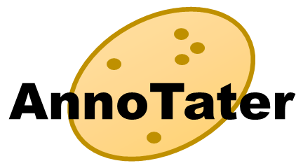

Welcome to AnnoTater documentation!
===================================

AnnoTater is a `Nextflow <https://www.nextflow.io/>`_ workflow that performs functional gene annotation for both genomes and de novo assembled transcriptomes.

nf-core Compatibility
---------------------
AnnoTater is an `nf-core <https://nf-co.re/>`_ compatible workflow.

Acknowledgments
---------------
AnnoTater is written by the `Ficklin Computational Biology Team <http://ficklinlab.cahnrs.wsu.edu/>`_ at `Washington State University <http://www.wsu.edu>`_. Development of AnnoTater was funded by the U.S. National Science Foundation (NSF) Award `#1659300 <https://www.nsf.gov/awardsearch/showAward?AWD_ID=1659300&HistoricalAwards=false>`_. 

.. toctree::
   :maxdepth: 2
   :caption: Contents:

   installation
   explore
   prepare_data
   execution
   results
   whats_next
   troubleshooting
   citations
